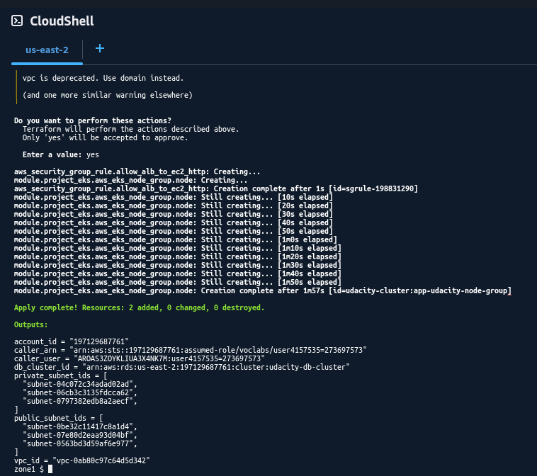
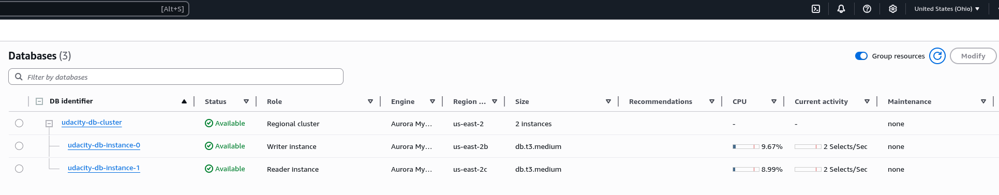
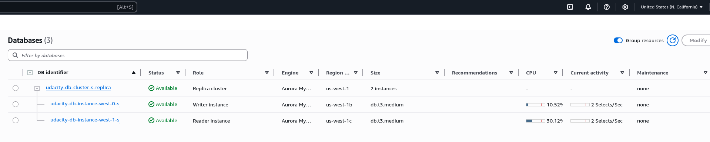
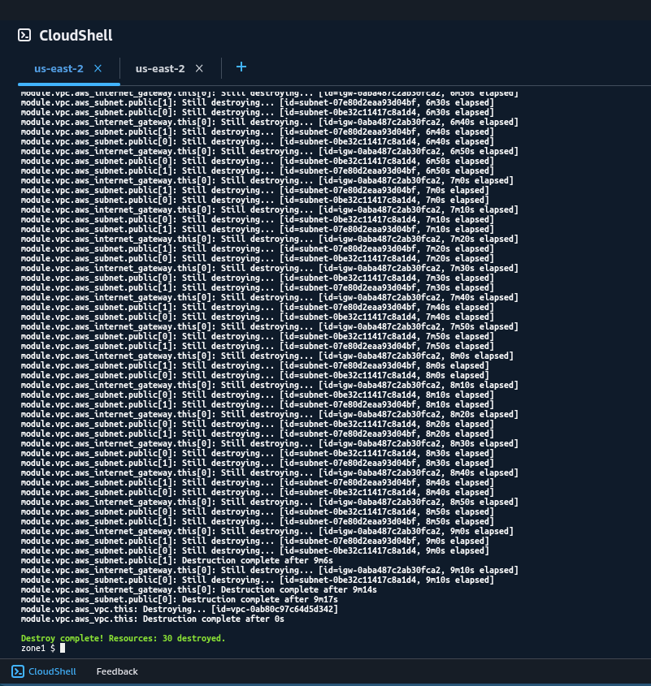
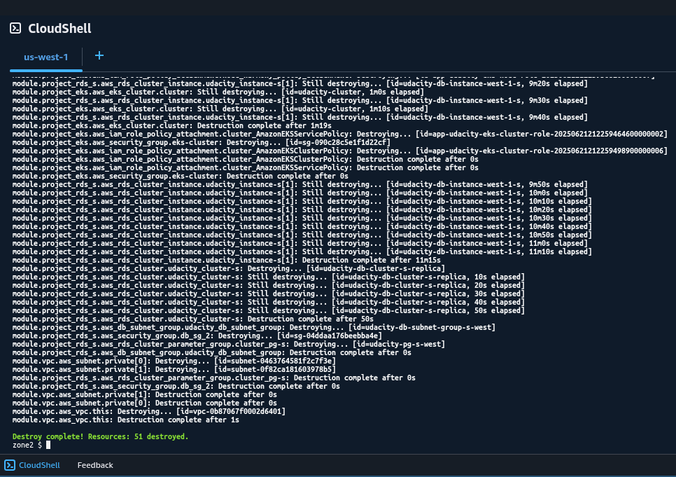

# Infrastructure

## AWS Zones

Identify your zones here

* Primary: us-east-2a, us-east-2b, us-east-2c
* Secondary (DR): us-west-1b, us-west-1c

**Note:** added annex below, with commands to identify zones.

## Servers and Clusters

### Table 1.1 Summary
| Asset                     | Purpose                                | Size             | Qty (per Region)        | DR Strategy                                                                    |
| :------------------------ | :------------------------------------- | :--------------- | :---------------------- | :----------------------------------------------------------------------------- |
| Application AMI           | Base image for web servers             | N/A              | 1                       | Replicated to each region.                                                     |
| EC2 Instances             | Host web application                   | `t3.micro`       | 3                       | Deployed in each region across multiple AZs.                                   |
| EKS Cluster               | Run monitoring stack                   | `t3.medium`      | 2 nodes                 | Deployed in each region across multiple AZs.                                   |
| VPC                       | Network isolation                      | N/A              | 1                       | Independent VPC in each region with subnets across multiple AZs.               |
| Application Load Balancer | Distribute web traffic                 | N/A              | 1                       | Deployed in each region. DNS failover between regions.                         |
| SQL Database Cluster      | Application database                   | `db.t3.medium`   | 1 Cluster (2 instances) | Primary cluster in Zone 1, replicating to a read-replica cluster in Zone 2.    |
| Monitoring Stack          | Observability                          | (Runs on EKS)    | 1                       | Deployed on EKS in each region.                                                |
| DNS Records               | Route traffic to application           | N/A              | Global                  | Global records point to the active region's ALB.                               |

### Descriptions
*   **Application AMI:** A base image with the application, copied to both primary and DR regions for consistent deployments.
*   **EC2 Instances:** Web servers running the application, deployed across multiple Availability Zones (AZs) in each region and managed by an Auto Scaling Group behind a load balancer.
*   **EKS Cluster:** A Kubernetes cluster in each region to run the monitoring stack (Prometheus, Grafana), with nodes spread across AZs.
*   **VPC:** An isolated network in each region with public and private subnets across multiple AZs for high availability.
*   **Application Load Balancer (ALB):** An ALB in each region directs traffic to the local EC2 instances. Global DNS manages traffic failover between regions.
*   **SQL Database Cluster:** A managed SQL database cluster (e.g., Aurora) with a writer and reader instance in each region. The primary region's cluster replicates to the DR region's cluster, which acts as a read replica until a failover event. Backups are retained for 5 days.
*   **Monitoring Stack:** A Prometheus and Grafana stack deployed in each region provides local observability. Configurations are stored in version control.
*   **DNS Records:** Global DNS records (e.g., Route 53) point to the active region's ALB. Low TTL values are used to speed up failover.
*   **Supporting Resources:** All necessary supporting resources like IAM Roles, Security Groups, and Key Pairs are deployed independently in each region via Infrastructure as Code.

## DR Plan

### Pre-Steps (Initial Setup of HA and DR Environments)
*   Prepare the Application AMI and copy it to both primary (Zone 1) and DR (Zone 2) regions.
*   Set up infrastructure-as-code (IaC) configuration for both regions, including separate state storage (e.g., S3 buckets).
*   Provision the primary infrastructure in Zone 1, including VPC, EC2 instances, EKS cluster, ALB, and the primary SQL database cluster.
*   Provision the DR infrastructure in Zone 2, mirroring the setup in Zone 1.
*   Configure the Zone 2 SQL database as a cross-region replica of the Zone 1 primary database.
*   Deploy the monitoring stack (Prometheus/Grafana) in each region and confirm it is collecting metrics from local resources.
*   Configure global DNS records to point to the Zone 1 ALB with a low TTL.
*   Test both application environments to ensure they are functional. Verify database replication is healthy.
*   Document the Recovery Point Objective (RPO) based on database replication lag and the estimated Recovery Time Objective (RTO).

### Steps

*   **Detect and Declare:** Monitor alerts and dashboards to detect a critical outage in Zone 1. Once confirmed, declare a disaster and get approval to fail over.
*   **Promote Database:** Promote the read-replica SQL database cluster in Zone 2 to a standalone, writable primary cluster. This breaks the replication link from Zone 1.
*   **Redirect Traffic:** Update the global DNS record to point from the Zone 1 ALB to the Zone 2 ALB.
*   **Verify Application:** Ensure the application in Zone 2 is fully operational and correctly connected to the newly promoted database. Perform health checks and synthetic tests.
*   **Communicate:** Notify all stakeholders that the failover to the DR region is complete and the application is operational.
*   **Isolate Old Primary:** To prevent issues, consider stopping services or blocking traffic to the original Zone 1 infrastructure if it is partially active.

### Annex: Terraform runs and screenshots of AWS resources

#### Step 4 - Zone 1




#### Step 5 - Zone 2


#### RDS replication

Zone 1:

Zone 2:


#### Step 7 - Terraform destroy

Zone 1:

Zone 2:


### Annex: Zones identification command outputs

```bash
project $ aws ec2 describe-availability-zones --region us-east-2 --output table 
-----------------------------------------------------------------------------------------------------------------------------------------------------------------
|                                                                   DescribeAvailabilityZones                                                                   |
+---------------------------------------------------------------------------------------------------------------------------------------------------------------+
||                                                                      AvailabilityZones                                                                      ||
|+------------------+-----------------+---------------------+----------------------+-------------+------------+-----------+--------------+---------------------+|
||   GroupLongName  |    GroupName    | NetworkBorderGroup  |     OptInStatus      | RegionName  |   State    |  ZoneId   |  ZoneName    |      ZoneType       ||
|+------------------+-----------------+---------------------+----------------------+-------------+------------+-----------+--------------+---------------------+|
||  US East (Ohio) 1|  us-east-2-zg-1 |  us-east-2          |  opt-in-not-required |  us-east-2  |  available |  use2-az1 |  us-east-2a  |  availability-zone  ||
|+------------------+-----------------+---------------------+----------------------+-------------+------------+-----------+--------------+---------------------+|
||                                                                      AvailabilityZones                                                                      ||
|+------------------+-----------------+---------------------+----------------------+-------------+------------+-----------+--------------+---------------------+|
||   GroupLongName  |    GroupName    | NetworkBorderGroup  |     OptInStatus      | RegionName  |   State    |  ZoneId   |  ZoneName    |      ZoneType       ||
|+------------------+-----------------+---------------------+----------------------+-------------+------------+-----------+--------------+---------------------+|
||  US East (Ohio) 1|  us-east-2-zg-1 |  us-east-2          |  opt-in-not-required |  us-east-2  |  available |  use2-az2 |  us-east-2b  |  availability-zone  ||
|+------------------+-----------------+---------------------+----------------------+-------------+------------+-----------+--------------+---------------------+|
||                                                                      AvailabilityZones                                                                      ||
|+------------------+-----------------+---------------------+----------------------+-------------+------------+-----------+--------------+---------------------+|
||   GroupLongName  |    GroupName    | NetworkBorderGroup  |     OptInStatus      | RegionName  |   State    |  ZoneId   |  ZoneName    |      ZoneType       ||
|+------------------+-----------------+---------------------+----------------------+-------------+------------+-----------+--------------+---------------------+|
||  US East (Ohio) 1|  us-east-2-zg-1 |  us-east-2          |  opt-in-not-required |  us-east-2  |  available |  use2-az3 |  us-east-2c  |  availability-zone  ||
|+------------------+-----------------+---------------------+----------------------+-------------+------------+-----------+--------------+---------------------+|
```

```bash
project $ aws ec2 describe-availability-zones --region us-west-1 --output table

--------------------------------------------------------------------------------------------------------------------------------------------------------------------------
|                                                                        DescribeAvailabilityZones                                                                       |
+------------------------------------------------------------------------------------------------------------------------------------------------------------------------+
||                                                                           AvailabilityZones                                                                          ||
|+---------------------------+-----------------+---------------------+----------------------+-------------+------------+-----------+--------------+---------------------+|
||       GroupLongName       |    GroupName    | NetworkBorderGroup  |     OptInStatus      | RegionName  |   State    |  ZoneId   |  ZoneName    |      ZoneType       ||
|+---------------------------+-----------------+---------------------+----------------------+-------------+------------+-----------+--------------+---------------------+|
||  US West (N. California) 1|  us-west-1-zg-1 |  us-west-1          |  opt-in-not-required |  us-west-1  |  available |  usw1-az3 |  us-west-1b  |  availability-zone  ||
|+---------------------------+-----------------+---------------------+----------------------+-------------+------------+-----------+--------------+---------------------+|
||                                                                           AvailabilityZones                                                                          ||
|+---------------------------+-----------------+---------------------+----------------------+-------------+------------+-----------+--------------+---------------------+|
||       GroupLongName       |    GroupName    | NetworkBorderGroup  |     OptInStatus      | RegionName  |   State    |  ZoneId   |  ZoneName    |      ZoneType       ||
|+---------------------------+-----------------+---------------------+----------------------+-------------+------------+-----------+--------------+---------------------+|
||  US West (N. California) 1|  us-west-1-zg-1 |  us-west-1          |  opt-in-not-required |  us-west-1  |  available |  usw1-az1 |  us-west-1c  |  availability-zone  ||
|+---------------------------+-----------------+---------------------+----------------------+-------------+------------+-----------+--------------+---------------------+|
```
