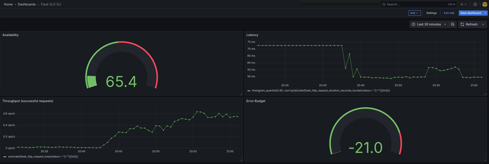

## Availability SLI
### The percentage of successful requests over the last 5m

```promql
sum(rate(flask_http_request_total{status!~"5.."}[5m]))/ sum(rate(flask_http_request_total[5m]))*100
```

## Latency SLI
### 90% of requests finish in these times

```promql
histogram_quantile(0.90, sum by(le)(rate(flask_http_request_duration_seconds_bucket{status=~"2.*"}[5m])))
```

## Throughput
### Successful requests per second

```promql
sum(rate(flask_http_request_total{status=~"2.*"}[5m]))
```


## Error Budget - Remaining Error Budget
### The error budget is 20%

```promql
(
    1 - (
        (1 - (sum(increase(flask_http_request_total{status!~"5.."}[7d])) / sum(increase(flask_http_request_total[7d]))))
        /
        (1 - 0.80)
    )
) * 100
```

## Annex: Grafana dashboard


