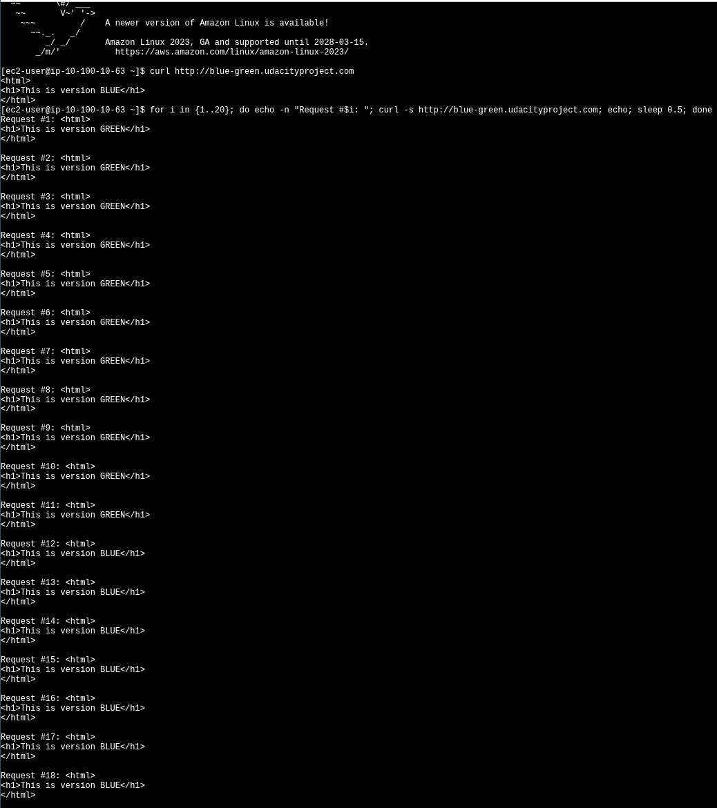
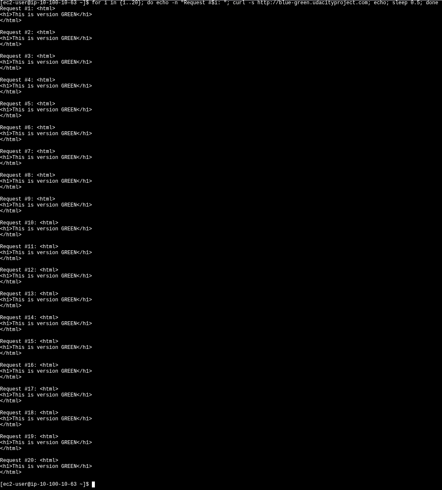
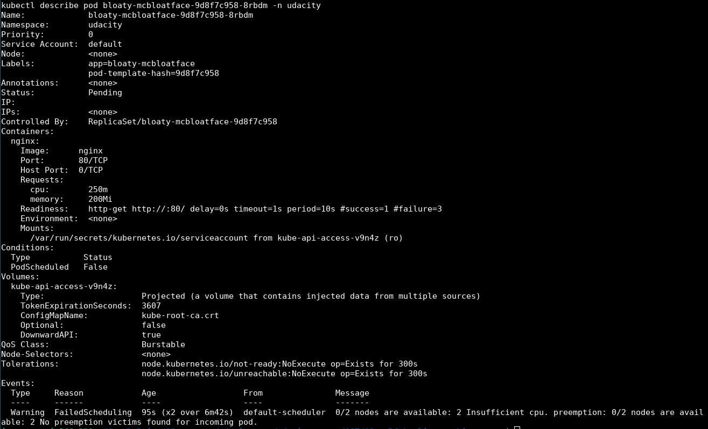
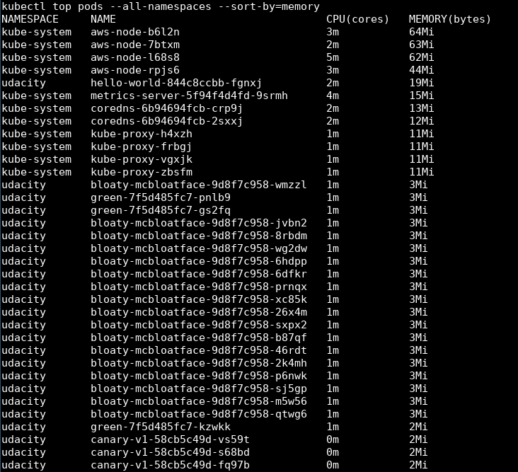
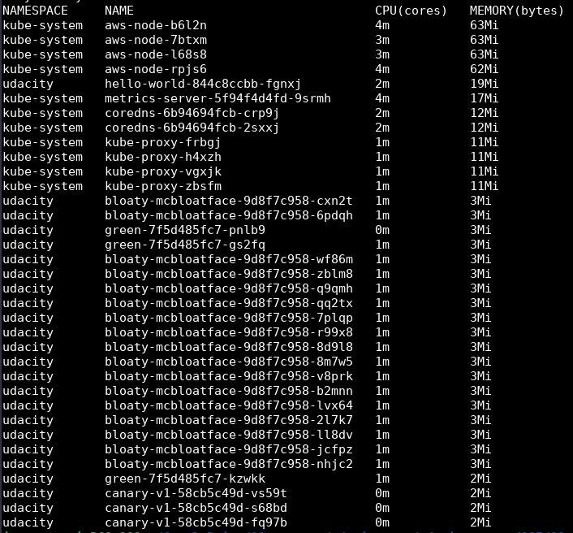

## Step 01: Deployment Troubleshooting

### Project Overview


### Deployment Troubleshooting Error

The content of [`log_outputs/01_deployment_troubleshooting_error.md`](log_outputs/01_deployment_troubleshooting_error.md) is embedded below.

```
kubectl logs hello-world-6464549999-66mkb
Ready to receive requests on 9000
 * Serving Flask app 'main' (lazy loading)
 * Environment: production
   WARNING: This is a development server. Do not use it in a production deployment.
   Use a production WSGI server instead.
 * Debug mode: off
 * Running on all addresses.
   WARNING: This is a development server. Do not use it in a production deployment.
 * Running on http://10.100.1.49:9000/ (Press CTRL+C to quit)
Failed health check you want to ping /healthz
10.100.1.28 - - [25/Jun/2025 23:25:09] "GET /nginx_status HTTP/1.1" 500 -
10.100.1.28 - - [25/Jun/2025 23:25:11] "GET /nginx_status HTTP/1.1" 500 -
Failed health check you want to ping /healthz
Failed health check you want to ping /healthz
10.100.1.28 - - [25/Jun/2025 23:25:13] "GET /nginx_status HTTP/1.1" 500 -

```

### Deployment Fix

The content of [`log_outputs/01_deployment_fix.md`](log_outputs/01_deployment_fix.md) is embedded below.

```
kubectl logs hello-world-844c8ccbb-9gqt6
Ready to receive requests on 9000
 * Serving Flask app 'main' (lazy loading)
 * Environment: production
   WARNING: This is a development server. Do not use it in a production deployment.
   Use a production WSGI server instead.
 * Debug mode: off
 * Running on all addresses.
   WARNING: This is a development server. Do not use it in a production deployment.
 * Running on http://10.100.1.222:9000/ (Press CTRL+C to quit)
Healthy!
10.100.1.28 - - [25/Jun/2025 23:32:23] "GET /healthz HTTP/1.1" 200 -
Healthy!
10.100.1.28 - - [25/Jun/2025 23:32:25] "GET /healthz HTTP/1.1" 200 -
Healthy!
10.100.1.28 - - [25/Jun/2025 23:32:27] "GET /healthz HTTP/1.1" 200 -
Healthy!
10.100.1.28 - - [25/Jun/2025 23:32:29] "GET /healthz HTTP/1.1" 200 -
Healthy!
10.100.1.28 - - [25/Jun/2025 23:32:31] "GET /healthz HTTP/1.1" 200 -
Healthy!
10.100.1.28 - - [25/Jun/2025 23:32:33] "GET /healthz HTTP/1.1" 200 -
Healthy!
10.100.1.28 - - [25/Jun/2025 23:32:35] "GET /healthz HTTP/1.1" 200 -
Healthy!
10.100.1.28 - - [25/Jun/2025 23:32:37] "GET /healthz HTTP/1.1" 200 -
Healthy!
10.100.1.28 - - [25/Jun/2025 23:32:39] "GET /healthz HTTP/1.1" 200 -

```

## Step 2: Canary Deployments

The product teams require a canary deployment for version 2 of the `/apps/canary` microservice to safely test new features. The objective is to configure the deployment so that `canary-v2` handles 50% of the client requests.

### `canary.sh` Script

A shell script, `canary.sh`, is used to automate the deployment process. This script ensures that both `v1` and `v2` of the canary application are updated and then scales them to an equal number of replicas. This configuration achieves a 50/50 traffic distribution between the two versions.

### Deployment Results

The output from the verification script confirms the success of the canary deployment. The `canary.txt` file shows mixed responses from both `v1` and `v2`, indicating that traffic is being distributed between the two versions.

The content of [`canary.txt`](log_outputs/canary.txt) is embedded below.

```
--------------------------
Request: 1
<html>
<h1>This is version 2</h1>
</html>

--------------------------
Request: 2
<html>
<h1>This is version 1</h1>
</html>

--------------------------
Request: 3
<html>
<h1>This is version 1</h1>
</html>

--------------------------
Request: 4
<html>
<h1>This is version 2</h1>
</html>

--------------------------
Request: 5
<html>
<h1>This is version 2</h1>
</html>

--------------------------
Request: 6
<html>
<h1>This is version 1</h1>
</html>

--------------------------
Request: 7
<html>
<h1>This is version 2</h1>
</html>

--------------------------
Request: 8
<html>
<h1>This is version 1</h1>
</html>

--------------------------
Request: 9
<html>
<h1>This is version 1</h1>
</html>

--------------------------
Request: 10
<html>
<h1>This is version 1</h1>
</html>

Curl attempts finished.
pod "canary-debug-curl" deleted
```

Additionally, the `log_outputs/canary2.txt` file shows that there are two pods for `canary-v1` and two pods for `canary-v2`, confirming the 50/50 replica split.

The content of [`log_outputs/canary2.txt`](log_outputs/canary2.txt) is embedded below.

```
NAMESPACE     NAME                          READY   STATUS    RESTARTS   AGE
kube-system   aws-node-ffd8k                2/2     Running   0          83m
kube-system   aws-node-xwgx9                2/2     Running   0          83m
kube-system   coredns-6b94694fcb-f8sfx      1/1     Running   0          85m
kube-system   coredns-6b94694fcb-jjv8l      1/1     Running   0          85m
kube-system   kube-proxy-g4zzr              1/1     Running   0          83m
kube-system   kube-proxy-gs5w4              1/1     Running   0          83m
udacity       blue-68f654b6f9-9p5tq         1/1     Running   0          47m
udacity       blue-68f654b6f9-cwllx         1/1     Running   0          47m
udacity       blue-68f654b6f9-jjcwz         1/1     Running   0          47m
udacity       canary-v1-58cb5c49d-5q45p     1/1     Running   0          47m
udacity       canary-v1-58cb5c49d-fkc88     1/1     Running   0          47m
udacity       canary-v2-55647dff9d-5b5pq    1/1     Running   0          26m
udacity       canary-v2-55647dff9d-gwmvg    1/1     Running   0          26m
udacity       hello-world-844c8ccbb-9gqt6   1/1     Running   0          37m
```

## Step 3: Blue/Green Deployments

A blue-green deployment strategy was implemented using weighted DNS records in Route 53 to split traffic between a `blue` and a `green` version of the application.

### 1. 50/50 Traffic Split Verification

The following command was run on the `curl` instance to test traffic distribution.

```bash
for i in {1..20}; do echo -n "Request #$i: "; curl -s http://blue-green.udacityproject.com; echo; sleep 0.5; done
```

The output shows a mix of `blue` and `green` responses, confirming the 50/50 split.



### 2. Failover Simulation

The `blue` deployment was deleted to simulate a failover.

```bash
kubectl delete deployment blue -n udacity
```

### 3. Failover Verification

The test command was run again. The output now shows only `green` responses, confirming a successful failover.



## Step 4: Node Elasticity

The `bloaty-mcface` deployment failed because the 2-node EKS cluster had insufficient CPU capacity to run all 17 replicas.

### Deployment Failure

The `kubectl describe pod` command confirmed a `FailedScheduling` event due to insufficient CPU resources on the available nodes.



### Resolution

The EKS cluster was scaled from 2 to 4 nodes by modifying `starter/infra/eks.tf`.

```diff
--- a/03-self-healing-architectures/starter/infra/eks.tf
+++ b/03-self-healing-architectures/starter/infra/eks.tf
@@ -19,8 +19,8 @@ module "project_eks" {
   account            = data.aws_caller_identity.current.account_id
   private_subnet_ids = module.vpc.private_subnet_ids
   vpc_id             = module.vpc.vpc_id
-  nodes_desired_size = 2
-  nodes_max_size     = 2
+  nodes_desired_size = 4
+  nodes_max_size     = 4
   nodes_min_size     = 1
 
   depends_on = [

```

### Verification

After applying the change, all 17 `bloaty-mcface` pods were successfully scheduled and set to a `Running` state. The content of [`log_outputs/node-elasticity.txt`](log_outputs/node-elasticity.txt) is embedded below.

```
NAMESPACE     NAME                                 READY   STATUS    RESTARTS   AGE
kube-system   aws-node-7btxm                       2/2     Running   0          77m
kube-system   aws-node-b6l2n                       2/2     Running   0          77m
kube-system   aws-node-l68s8                       2/2     Running   0          7m5s
kube-system   aws-node-rpjs6                       2/2     Running   0          7m2s
kube-system   coredns-6b94694fcb-2sxxj             1/1     Running   0          79m
kube-system   coredns-6b94694fcb-crp9j             1/1     Running   0          79m
kube-system   kube-proxy-frbgj                     1/1     Running   0          77m
kube-system   kube-proxy-h4xzh                     1/1     Running   0          77m
kube-system   kube-proxy-vgxjk                     1/1     Running   0          7m2s
kube-system   kube-proxy-zbsfm                     1/1     Running   0          7m5s
udacity       bloaty-mcbloatface-9d8f7c958-26x4m   1/1     Running   0          17m
udacity       bloaty-mcbloatface-9d8f7c958-2k4mh   1/1     Running   0          17m
udacity       bloaty-mcbloatface-9d8f7c958-46rdt   1/1     Running   0          17m
udacity       bloaty-mcbloatface-9d8f7c958-6dfkr   1/1     Running   0          17m
udacity       bloaty-mcbloatface-9d8f7c958-6hdpp   1/1     Running   0          17m
udacity       bloaty-mcbloatface-9d8f7c958-8rbdm   1/1     Running   0          17m
udacity       bloaty-mcbloatface-9d8f7c958-b87qf   1/1     Running   0          17m
udacity       bloaty-mcbloatface-9d8f7c958-jvbn2   1/1     Running   0          17m
udacity       bloaty-mcbloatface-9d8f7c958-m5w56   1/1     Running   0          17m
udacity       bloaty-mcbloatface-9d8f7c958-p6nwk   1/1     Running   0          17m
udacity       bloaty-mcbloatface-9d8f7c958-prnqx   1/1     Running   0          17m
udacity       bloaty-mcbloatface-9d8f7c958-qtwg6   1/1     Running   0          17m
udacity       bloaty-mcbloatface-9d8f7c958-sj5gp   1/1     Running   0          17m
udacity       bloaty-mcbloatface-9d8f7c958-sxpx2   1/1     Running   0          17m
udacity       bloaty-mcbloatface-9d8f7c958-wg2dw   1/1     Running   0          17m
udacity       bloaty-mcbloatface-9d8f7c958-wmzzl   1/1     Running   0          17m
udacity       bloaty-mcbloatface-9d8f7c958-xc85k   1/1     Running   0          17m
udacity       canary-v1-58cb5c49d-fq97b            1/1     Running   0          38m
udacity       canary-v1-58cb5c49d-s68bd            1/1     Running   0          38m
udacity       canary-v1-58cb5c49d-vs59t            1/1     Running   0          38m
udacity       green-7f5d485fc7-gs2fq               1/1     Running   0          56m
udacity       green-7f5d485fc7-kzwkk               1/1     Running   0          56m
udacity       green-7f5d485fc7-pnlb9               1/1     Running   0          56m
udacity       hello-world-844c8ccbb-fgnxj          1/1     Running   0          38m
```

## Step 5: Observability and Memory Management

### 1. Memory Usage Before Cleanup

The `kubectl top pods --all-namespaces --sort-by=memory` command was run to identify high-memory pods.



### 2. High-Memory Application Identified

The `hello-world` application was identified as the highest memory consumer.

The content of [`log_outputs/high_memory.txt`](log_outputs/high_memory.txt) is embedded below.

### 3. Deletion of High-Memory Application

The `hello-world` deployment was deleted to free up resources.

```bash
kubectl delete deployment hello-world -n udacity
```

### 4. Memory Usage After Cleanup

Running the `kubectl top pods` command again confirms the successful removal of the `hello-world` pods.



## Step 6: Canary Deployments with Blue/Green and Self-Healing

```plantuml
@startuml
!include <https://raw.githubusercontent.com/plantuml-stdlib/C4-PlantUML/master/C4_Container.puml>

' Layout and Title
LAYOUT_WITH_LEGEND()
title Deployment Roulette - System Architecture

' Actors and External Systems
Person(developer, "SRE / Developer", "Writes code & config.")
Person(user, "End User", "Accesses the application.")
System_Ext(github, "GitHub Repository", "Stores source code and IaC manifests.")

' AWS Boundary
System_Boundary(aws, "AWS Cloud Environment") {

    Container(s3, "Terraform State Backend", "Amazon S3", "Stores infrastructure state.")
    Container(route53, "blue-green.udacityproject.com", "Amazon Route 53", "Provides weighted DNS routing.")

    ' VPC Boundary
    System_Boundary(vpc, "Amazon VPC") {
        
        Container(blue_lb, "Blue NLB", "AWS Network Load Balancer", "Created by blue-svc.")
        Container(green_lb, "Green NLB", "AWS Network Load Balancer", "Created by green-svc.")

        ' EKS Cluster Boundary
        System_Boundary(eks, "Amazon EKS Cluster") {
            Container(blue_deployment, "Blue Deployment", "Pods running nginx v1")
            Container(green_deployment, "Green Deployment", "Pods running nginx v2")
            
            ' FIX: Changed from Component to Container to resolve syntax error.
            Container(blue_svc, "blue-svc", "Kubernetes Service", "Exposes the Blue Deployment and creates the Blue NLB.")
            Container(green_svc, "green-svc", "Kubernetes Service", "Exposes the Green Deployment and creates the Green NLB.")
        }
    }
}

' Relationships
' Developer and CI/CD Flow
Rel(developer, github, "1. Pushes code and config")
Rel(github, s3, "2. CI/CD Pipeline uses for state", "Terraform")
Rel(github, eks, "3. CI/CD Pipeline deploys manifests", "kubectl / Terraform")

' User Traffic Flow for Blue/Green Deployment
Rel(user, route53, "A. Sends request")
Rel(route53, blue_lb, "B1. Routes traffic (weighted)")
Rel(route53, green_lb, "B2. Routes traffic (weighted)")

Rel(blue_lb, blue_svc, "C1. Forwards traffic")
Rel(green_lb, green_svc, "C2. Forwards traffic")

Rel(blue_svc, blue_deployment, "D1. Selects 'blue' pods")
Rel(green_svc, green_deployment, "D2. Selects 'green' pods")

@enduml
```